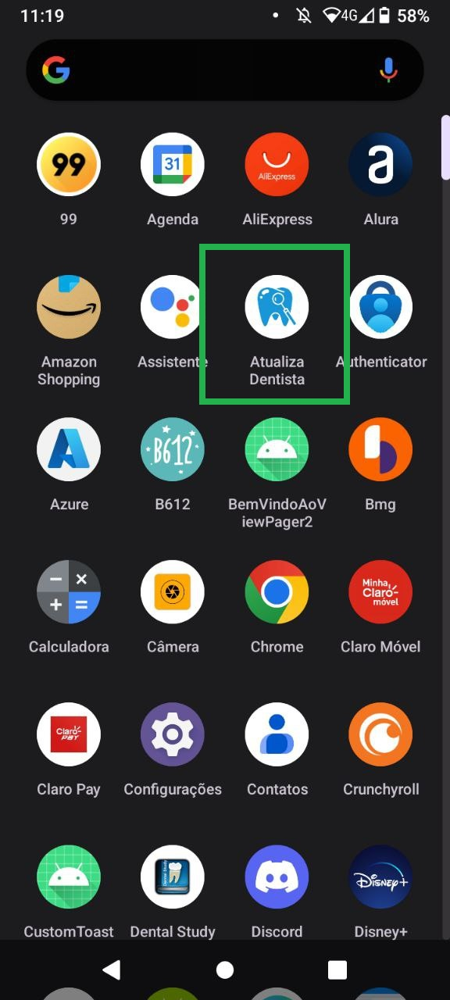
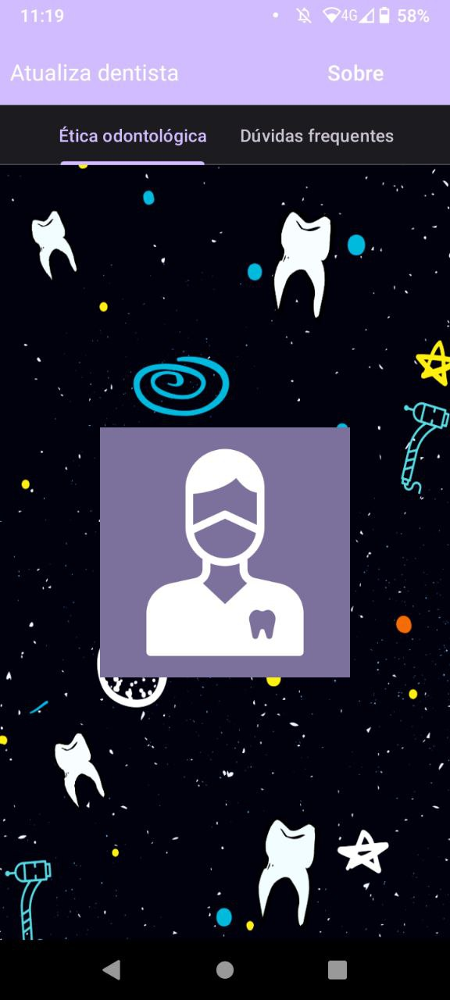
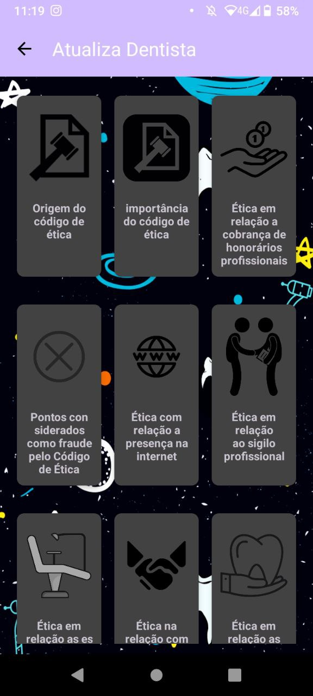
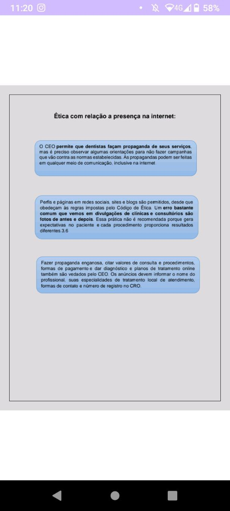
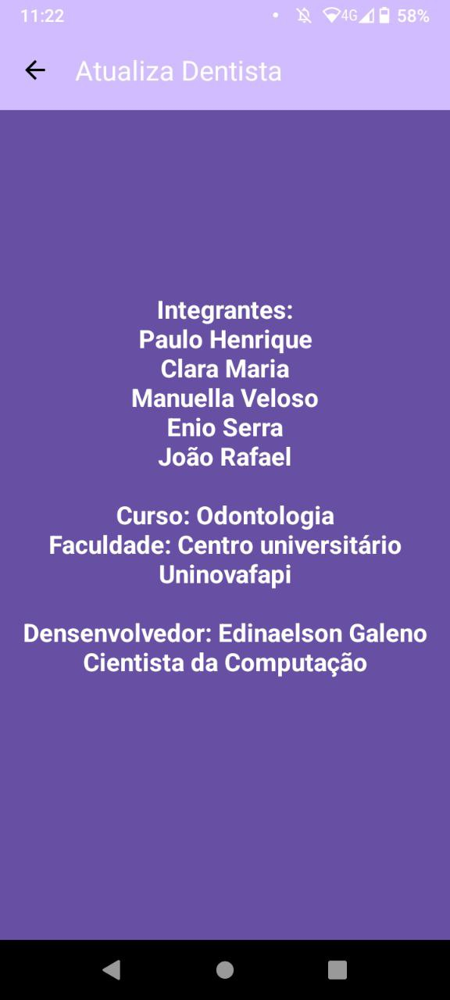
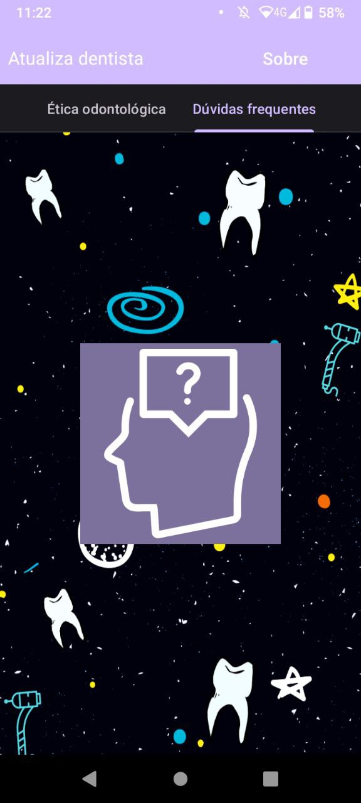
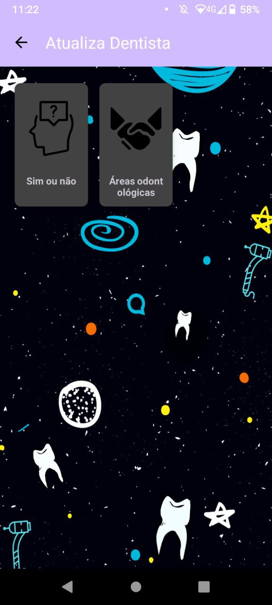
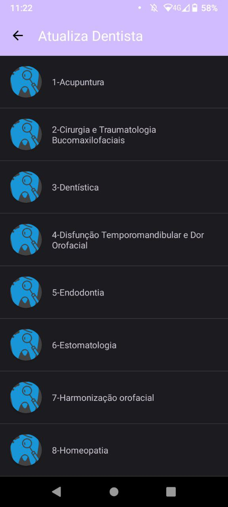
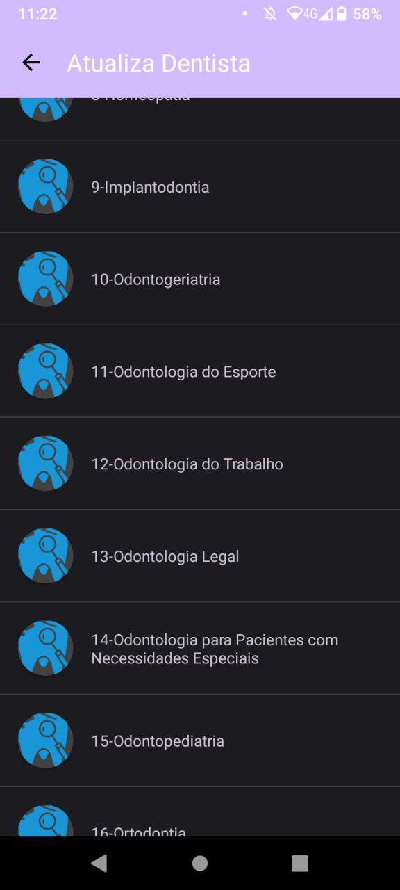

>Status: **Desenvolvendo**💻
## Atualiza dentista!
### **Descrição**📃

Projeto de Odontologia, que abri pdfs de acordo com o assunto clicado.

- [x] Abrir Pdfs
- [x] Grid Layouts
- [x] RecyclerView.
- [x] Abas.
- [x] botão voltar.

### Telas do Aplicativo

> ### Icone do App
> 

> ### Tela Inicial
> 

> ### GridLayout
> 

>  ### Pdf aberto
> 

> ### Botão Sobre
> 

> ### Tela Incial
> 

> ### GridLayout
> 

> ### RecyclerView
> 
> 
